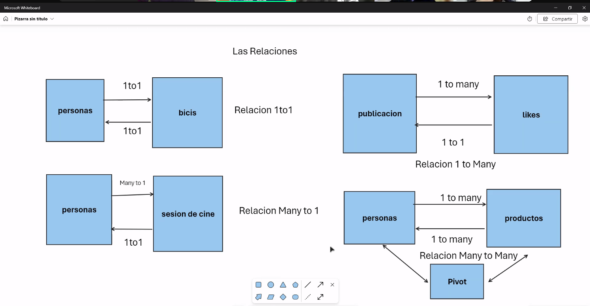
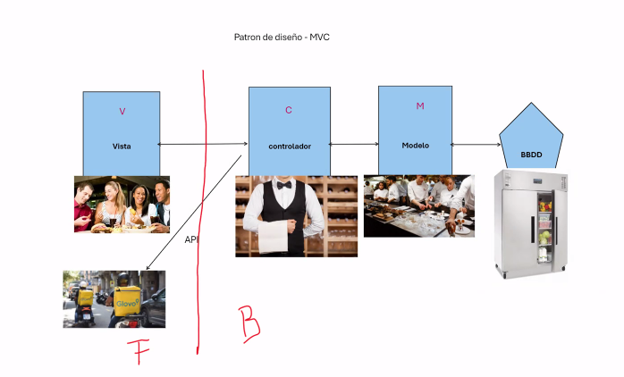

 guía para crear un proyecto en Laravel. He organizado la información en secciones claras y he añadido algunos comentarios para facilitar la comprensión.

---

Aquí tienes el texto refactorizado sobre la creación de un proyecto en Laravel, manteniendo toda la información original:

---

# Crear Proyecto en Laravel

### 1. Crear un Nuevo Proyecto

Copia y pega la siguiente línea de código en tu terminal:

```bash
composer create-project --prefer-dist laravel/laravel NombreDeTuCarpeta
```

### 2. Iniciar el Servidor Node.js

Ejecuta los siguientes comandos para iniciar el servidor Node.js:

```bash
npm install
npm update  # En caso de hacer un fork del repositorio o actualizar npm
npm run dev
```

### 3. Instalación de Composer en tu Proyecto

Ejecuta los siguientes comandos para instalar Composer:

```bash
composer install  # Instala Composer en el proyecto
composer update    # En caso de tener que actualizar
```

### 4. Iniciar el Servidor PHP/Laravel

Para iniciar el servidor PHP de Laravel, ejecuta:

```bash
npm run build
composer run dev
php artisan serve
```

### 5. Generar Clave para el Archivo `.env`

Genera la clave ejecutando:

```bash
php artisan key:generate
```

Verifica en el archivo `.env` que se haya generado correctamente. Luego, ejecuta:

```bash
php artisan config:cache  # Para resetear la KEY
```

### 6. Generar Tests y Reporte en el Índice

Ejecuta los siguientes comandos para generar tests y reportes:

```bash
php artisan test --coverage
php artisan test --coverage-html=coverage-report
```


### 7. Manejo de Errores en XAMPP


### 8. Hacer Migraciones a la Base de Datos y crear tablas

Para migrar tu código a la base de datos y crear tablas, ejecuta:

```bash
php artisan migrate:fresh 
php artisan migrate:fresh --seed
php artisan make:migration create_NombreDeTuTabla_table
```

### 9. Instalación de la API

Para instalar la API, ejecuta el siguiente comando en la carpeta `Routes`:

```bash
php artisan install:api
```

En `app/http/controllers`, crea la carpeta `api` y ejecuta:

```bash
php artisan make:controller Api/NombreDeTuControlador --resource
```

Esto también se debe repetir si haces tablas relacionadas. Asegúrate de descomentar las líneas en `phpunit.xml`.

###  11 Crear factorias
```
php artisan make:factory Nombredetufactoria
```


###  12 Crear Seeders
```
php artisan make:seeder NombredetuSeeder
```
### 10. Comando para Crear Modelo, Controlador y Tabla

Para crear un modelo, controlador y tabla (esto es para hacer tablas relacionadas), ejecuta:


![[Relaciones entre tablas.png]]

```bash
php artisan make:model Follow -mcr
```


### Instalar Laravel UI y Bootstrap Auth Scaffolding

Para instalar Laravel UI y el scaffolding de autenticación de Bootstrap, ejecuta los siguientes comandos:

```
composer require laravel/ui
php artisan ui bootstrap --auth
```
### 11. Empezar a Trabajar con Blade

- En `views`, crea las carpetas `components` y `layouts`. Dentro de `layouts`, crea el archivo `app.blade.php`.
- En `components`, crea `footer.blade.php` y `header.blade.php` y rellénalos con contenido básico.
- En `public`, crea la carpeta `css` y dentro, el archivo `app.css` para agregar estilos básicos.

### 12. Empezar a Trabajar con el Patrón de Diseño MVC


![[Patron de diseño MVC.png]]

- Para instalar el modelo:
  ```bash
  php artisan make:model NombreDeTuModelo
  ```

- Para instalar el controlador:
  ```bash
  php artisan make:controller NombreDeTuControlador
  ```

- Para instalar la vista:
  ```bash
  php artisan make:view home
  ```

### 13. Creación de Tests y Ejecución desde la Terminal

Para crear un test, ejecuta:

```bash
php artisan make:test NombreTest
```

Para ejecutar los tests, utiliza:

```bash
php artisan test --env=testing
php artisan test
php artisan test --coverage
```

### 14. Creación de Factorías

Para crear una factoría, ejecuta:

```bash
php artisan make:factory NombreFactory
```

### 15. Crear Faker para PHP Vanilla o Laravel

Visita el repositorio de Faker en GitHub: [Faker GitHub](https://github.com/fzaninotto/Faker)

### 16. Extensiones


-------

## Extensiones para Laravel

- **Laravel Blade Snippets (Winnie Lin)**: [Link](https://marketplace.visualstudio.com/items?itemName=onecentlin.laravel-blade)
- **Laravel Extra Intellisense (amir)**: [Link](https://marketplace.visualstudio.com/items?itemName=amiralizadeh9480.laravel-extra-intellisense)
- **Laravel Blade Formatter (Shuhei Hayashibara)**: [Link](https://marketplace.visualstudio.com/items?itemName=shufo.vscode-blade-formatter)
- **Laravel Intellisense (Mohamed Benhida)**: [Link](https://marketplace.visualstudio.com/items?itemName=mohamedbenhida.laravel-intellisense)
- **PHP Namespace Resolver (Mehedi Hassan)**: [Link](https://marketplace.visualstudio.com/items?itemName=MehediDracula.php-namespace-resolver)

## Extensiones para PHP Vanilla

- **PHP Intelephense (Ben Mewburn)**: [Link](https://marketplace.visualstudio.com/items?itemName=bmewburn.vscode-intelephense-client)
- **PHP IntelliSense (Damjan Cvetko)**: [Link](https://marketplace.visualstudio.com/items?itemName=zobo.php-intellisense)
- **PHP CS Fixer (junstyle)**: [Link](https://marketplace.visualstudio.com/items?itemName=junstyle.php-cs-fixer)
- **PHP Snippets from PHPStorm (Phiter Fernandes)**: [Link](https://marketplace.visualstudio.com/items?itemName=phiter.phpstorm-snippets)

---

Estas extensiones mejorarán tu experiencia de desarrollo en Laravel y PHP Vanilla, proporcionando herramientas útiles para la codificación y el mantenimiento del código.