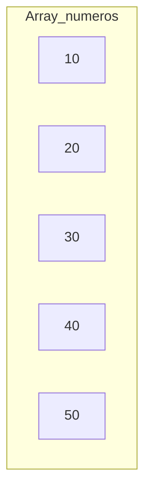

# Estructuras de datos básicas (Arrays)

### Introducción a los Arrays

Un array es una estructura de datos que permite almacenar múltiples valores del mismo tipo en una sola variable. Los elementos en un array se almacenan en posiciones de memoria contiguas y se acceden mediante índices (indices).

### ¿Qué es un Array Unidimensional?

Un array unidimensional es una lista lineal de elementos del mismo tipo. Cada elemento en el array puede ser accedido usando un índice, que es un número que indica la posición del elemento en el array.

### Representación Visual de un Array Unidimensional



### Declaración e Inicialización de Arrays

### 2.1 Declaración de un Array

Para declarar un array en Java, especificamos el tipo de datos (data type) seguido de corchetes `[]` y el nombre del array.

```java
int[] numeros; // Declaración de un array de enteros
```

### 2.2 Inicialización de un Array

Existen varias formas de inicializar un array:

1. **Inicialización al Declarar:**

```java
int[] numeros = new int[5]; // Array de 5 enteros, inicialmente todos en 0
```

1. **Inicialización con Valores:**

```java
int[] numeros = {10, 20, 30, 40, 50}; // Array de 5 enteros con valores específicos
```

### 3. Acceso y Manipulación de Elementos

### 3.1 Acceso a Elementos

Los elementos de un array se acceden mediante su índice (index), que comienza en 0.

```java
int primerNumero = numeros[0]; // Acceso al primer elemento
System.out.println("El primer número es: " + primerNumero);
```

### 3.2 Modificación de Elementos

Podemos cambiar el valor de un elemento usando su índice.

```java
numeros[1] = 25; // Modificación del segundo elemento
System.out.println("El segundo número es: " + numeros[1]);
```

### 4. Recorrido de un Array

Recorrer un array implica iterar sobre sus elementos utilizando un bucle (loop).

### 4.1 Uso de un Bucle For

```java
for (int i = 0; i < numeros.length; i++) {
    System.out.println("Elemento en la posición " + i + ": " + numeros[i]);
}
```

### 4.2 Uso de un Bucle For-Each

El bucle `for-each` simplifica la iteración sobre los elementos de un array.

```java
for (int numero : numeros) {
    System.out.println("Número: " + numero);
}
```

### 5. Ejemplo Completo: Operaciones con Arrays

A continuación, se presenta un ejemplo completo que muestra la declaración, inicialización, acceso, modificación y recorrido de un array, así como algunas operaciones comunes como la búsqueda (searching) de un elemento y la suma (sum) de todos los elementos.

```java
public class OperacionesConArrays {
    public static void main(String[] args) {
        // Declaración e Inicialización de un Array
        int[] numeros = {10, 20, 30, 40, 50};

        // Acceso y Modificación de Elementos
        numeros[1] = 25; // Modificación del segundo elemento
        System.out.println("El segundo número es: " + numeros[1]);

        // Recorrido del Array usando Bucle For
        for (int i = 0; i < numeros.length; i++) {
            System.out.println("Elemento en la posición " + i + ": " + numeros[i]);
        }

        // Recorrido del Array usando Bucle For-Each
        for (int numero : numeros) {
            System.out.println("Número: " + numero);
        }

        // Búsqueda de un Elemento en el Array
        int buscar = 30;
        boolean encontrado = false;
        for (int numero : numeros) {
            if (numero == buscar) {
                encontrado = true;
                break;
            }
        }
        if (encontrado) {
            System.out.println("El número " + buscar + " fue encontrado en el array.");
        } else {
            System.out.println("El número " + buscar + " no fue encontrado en el array.");
        }

        // Suma de Todos los Elementos del Array
        int suma = 0;
        for (int numero : numeros) {
            suma += numero;
        }
        System.out.println("La suma de todos los elementos es: " + suma);
    }
}

```

### Resumen

1. **Declaración de Arrays:** `int[] numeros;`
2. **Inicialización de Arrays:** `int[] numeros = new int[5];` o `int[] numeros = {10, 20, 30, 40, 50};`
3. **Acceso a Elementos:** `numeros[0]`
4. **Modificación de Elementos:** `numeros[1] = 25;`
5. **Recorrido de Arrays:** Bucle `for` y bucle `for-each`
6. **Operaciones Comunes:** Búsqueda y suma de elementos